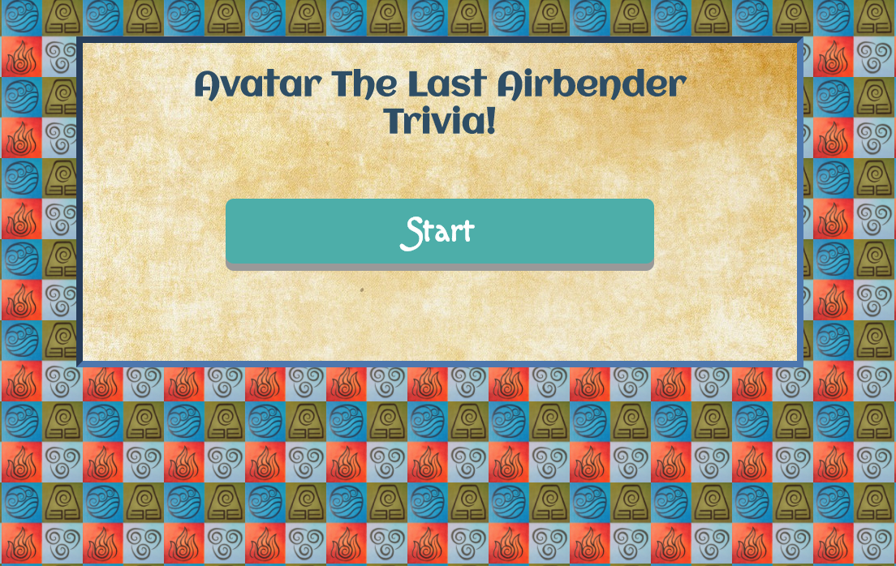
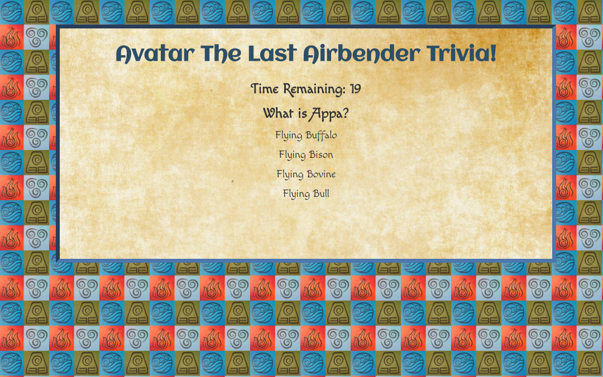
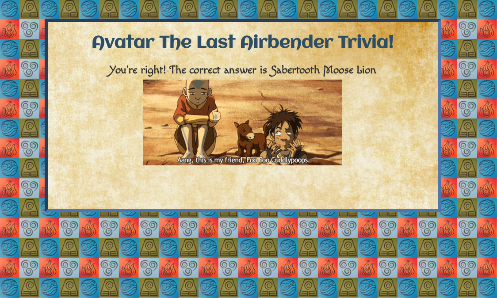
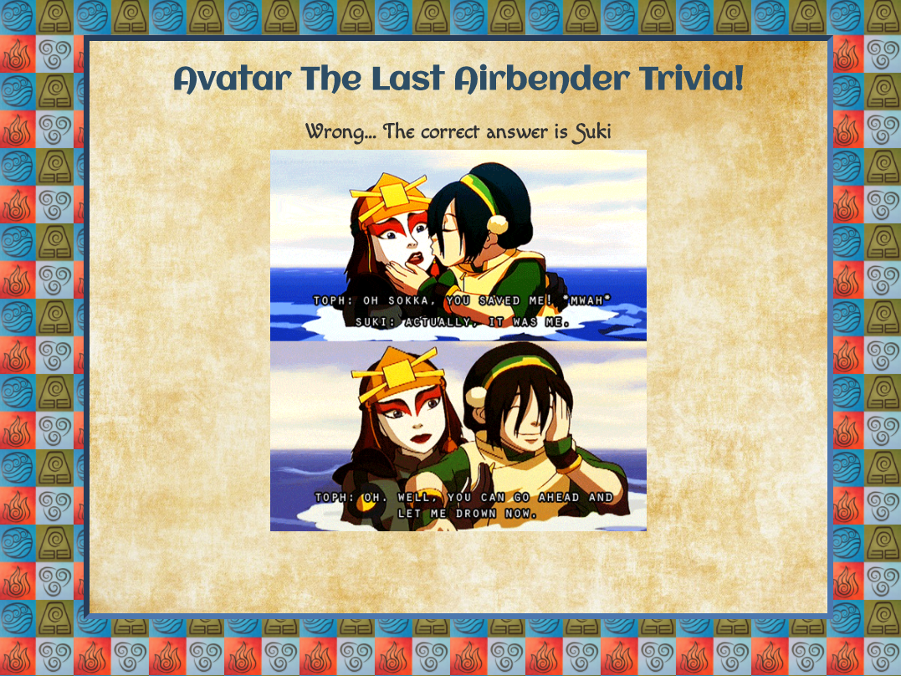
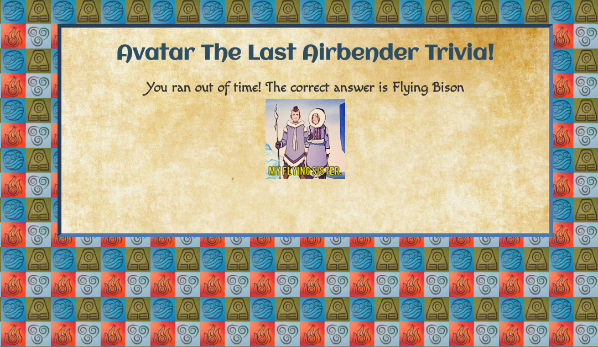
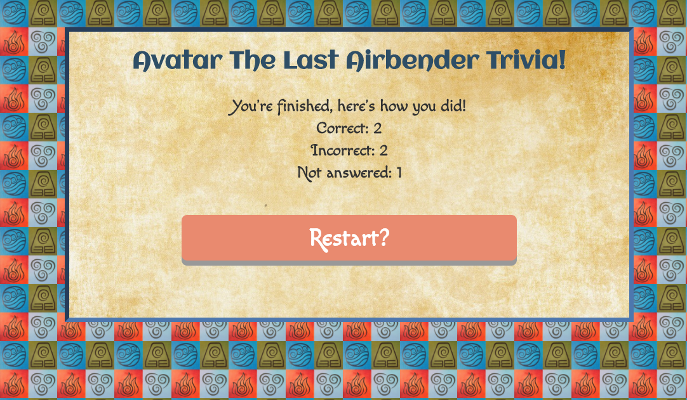

# Trivia-Game
Created a Trivia game with an _Avatar: The Last Airbender_ theme. This project uses setInterval to allow a set amount of time to answer each question and setTimeout to play gifs in between each question.

**Technology / concepts used:** setInterval, setTimeout, jQuery, JavaScript, HTML, and CSS.

Below are screenshots demonstrating the game:
##### Start Game

##### Example Question

##### Correct Answer

##### Wrong Answer

##### Ran Out of Time

##### End Game
